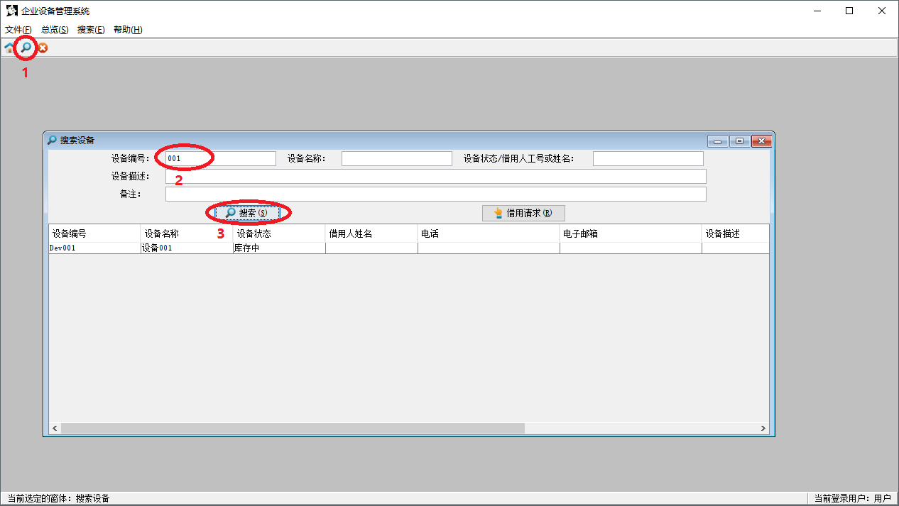
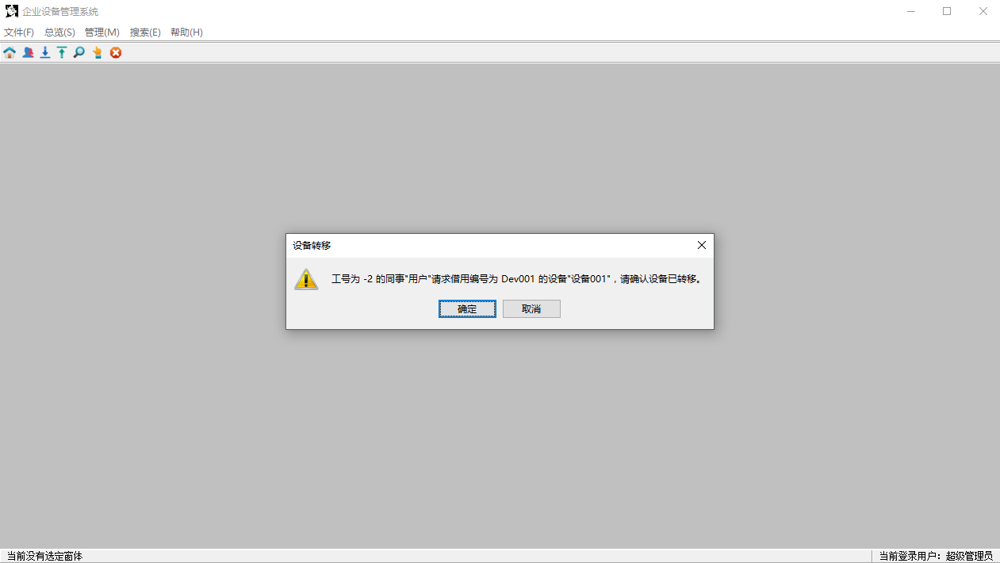
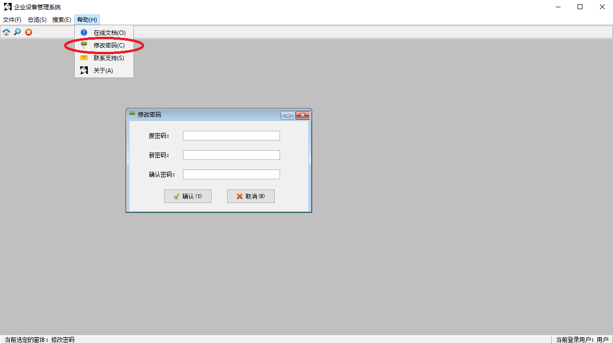
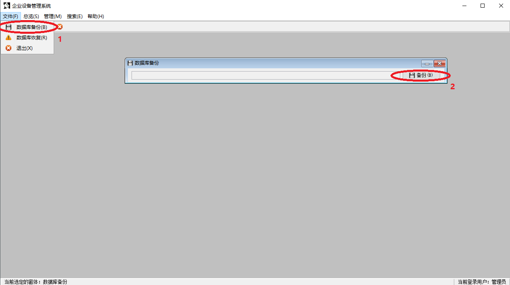
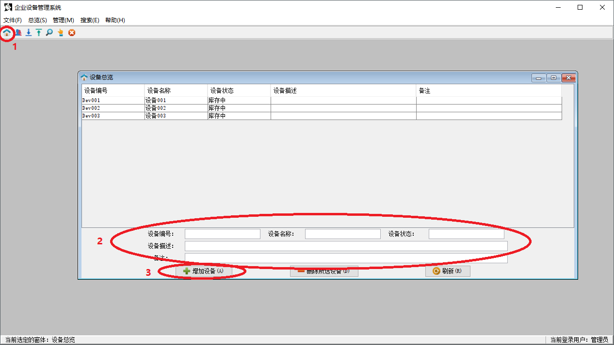
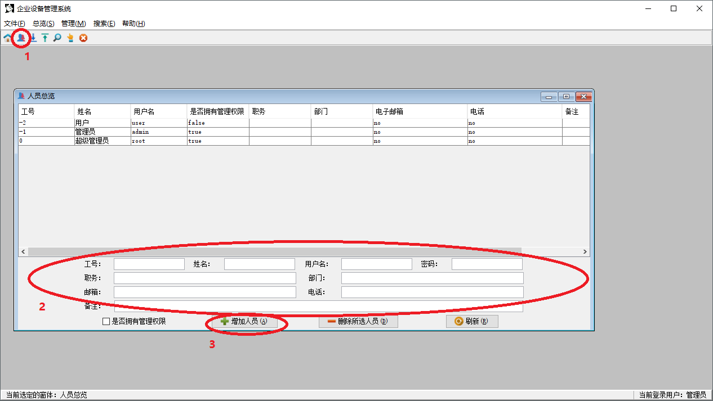
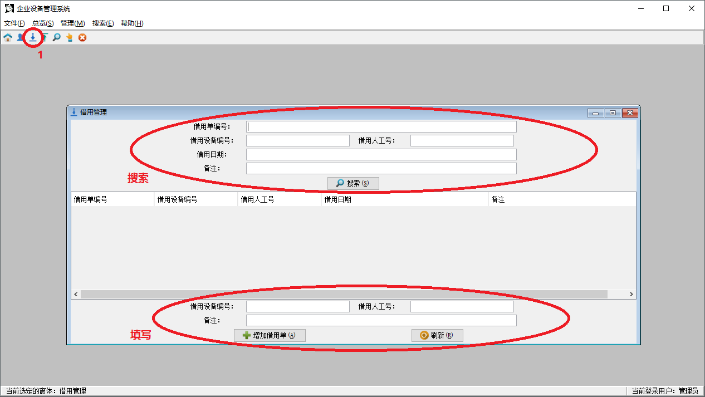
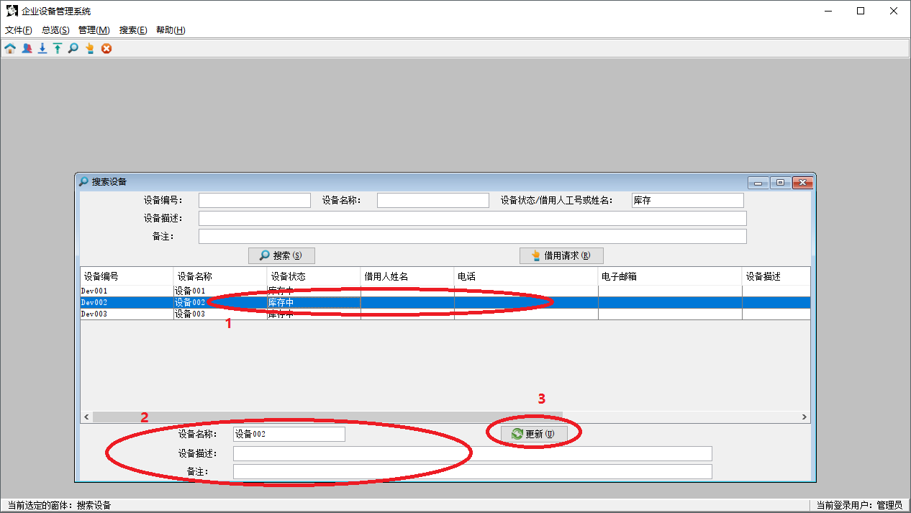
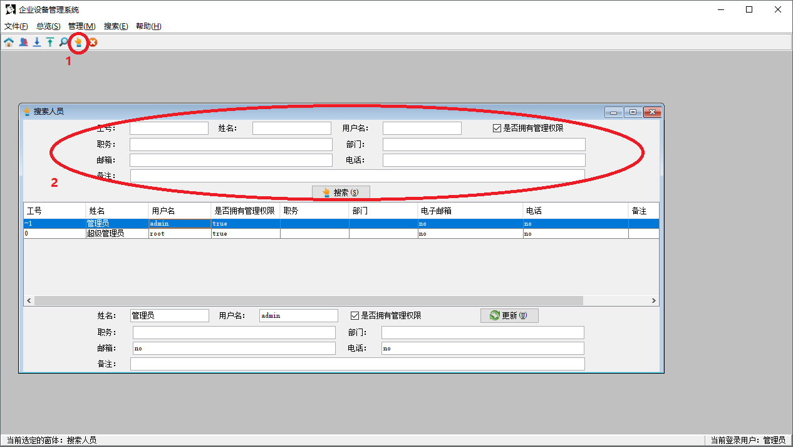

- [ 一般用户](#head1)
	- [ 查询设备状态](#head2)
		- [ 借用设备](#head3)
		- [ 发送借用请求](#head4)
	- [ 同意/拒绝借用请求](#head5)
	- [ 归还设备](#head6)
	- [ 修改密码](#head7)
- [ 管理员用户](#head8)
	- [ 备份数据库](#head9)
	- [ 恢复数据库](#head10)
	- [ 增加/删除设备](#head11)
	- [ 增加/删除人员](#head12)
	- [ 借用/归还管理](#head13)
		- [ 搜索借用单](#head14)
		- [ 填写借用单](#head15)
		- [ 搜索归还单](#head16)
		- [ 填写归还单](#head17)
	- [ 搜索/更新设备信息](#head18)
	- [ 搜索/更新人员信息](#head19)
- [ 快捷键技巧（可选）](#head20)
#  一般用户

一般用户即使用本系统的大部分用户，可以查看欲借用设备的当前状态、对已被他人借用的设备发送借用请求等，而不需要对系统进行操作。下面对一般用户操作进行详细描述：

##  查询设备状态

单击工具栏中的“搜索设备”图标开启搜索窗口：

输入设备编号或其他信息（支持模糊搜索），单击搜索即可查看符合搜索条件设备的当前状态。

###  借用设备

若显示“库存中”，则表明此设备未被借出，需要联系设备管理员借用并提供设备编号及工号；否则请参考“发送借用请求”。

###  发送借用请求

若显示“工号：*”，则表明此设备已被工号为\*的同事借用，并且可以查看该同事的姓名、电话、邮箱信息。单击“借用请求”按钮（）向该同事发送借用请求，发送成功之后即可联系该同事借用设备。

##  同意/拒绝借用请求

在借用设备之后您便拥有了防止设备损坏、避免设备丢失的责任和义务，表现在本系统中即为在其他同事联系您借用该设备时需要同意/拒绝其借用请求，具体操作如下。

在其他同事联系您之后，登录本系统并会在主界面收到设备转移提示：

若您确定已将此设备借给这位同事，请单击“确定”按钮，这就完成了设备转移。

若您无法将此设备借给这位同事并确认设备还在自己手上，您需要单击“取消”按钮来拒绝其借用请求。

##  归还设备

归还设备不需要直接在系统中进行操作，但需要联系管理员归还并提供设备编号以及工号。

##  修改密码

单击“帮助”菜单下的“修改密码”菜单项进入修改密码窗口：

输入原密码、新密码并确认密码即可。

#  管理员用户

管理员用户即设备管理员兼系统维护人员，除了一般用户所能进行的操作之外，还需要对设备的进出库进行管理、适时对数据库进行本地备份以维护数据安全。下面对管理员用户独有的操作进行详细描述：

##  备份数据库

为了数据安全，管理员应适时在本地备份数据库。单击“文件”菜单下的“数据库备份”菜单项进入数据库备份窗口：

单击右侧“备份”按钮即可在程序文件夹中的backup文件夹下备份数据库，并且备份文件以当前时间命名以便日后恢复数据库时识别。

##  恢复数据库

单击“文件”菜单下的“数据库恢复”菜单项进入数据库恢复窗口：

单击“选择数据库恢复文件”按钮，并在文件选择器中选择欲恢复的数据库文件，然后单击“恢复”按钮即可恢复。

##  增加/删除设备

单击工具栏中的“设备总览”图标：

在各设备信息输入文本框中输入设备信息，单击“增加设备”按钮即可。

若需要删除设备，则须在表格中选中欲删除的设备，然后单击“删除所选设备”按钮。

##  增加/删除人员

单击工具栏中的“人员总览”图标：

在各人员信息输入文本框中输入人员信息，单击“增加人员”按钮即可。

若需要删除人员，则须在表格中选中欲删除的人员，然后单击“删除所选人员”按钮。

##  借用/归还管理

管理员可以搜索/填写所有借用单、归还单，由于其为镜像，故下面以借用单为例描述如何进行操作：

###  搜索借用单

单击工具栏中的“借用管理”图标：

默认将倒序显示所有借用单信息，在各搜索文本框中输入搜索信息（支持模糊搜索），并单击“搜索”按钮即可进行借用单搜索。

###  填写借用单

若一般用户需要借用库存中的设备，则需要联系您并提供设备编号及其工号。将借用信息输入到窗口底部的文本框中后单击“增加借用单”按钮即可。

###  搜索归还单

具体操作可参考“搜索借用单”。

###  填写归还单

若一般用户需要归还设备至库存中，则需要联系您并提供设备编号及其工号。具体操作可参考“填写借用单”。

##  搜索/更新设备信息

搜索设备可参考“查询设备状态”。

若要更新设备信息，则在表格中选中欲更新的设备，在窗口底部各设备信息文本框中输入更新后的信息，单击“更新”按钮即可。

##  搜索/更新人员信息

单击工具栏中的“搜索人员”图标：

输入人员信息（支持模糊搜索），单击搜索即可查看符合搜索条件的人员。

更新人员信息的具体操作可参考“搜索/更新设备信息”。

#  快捷键技巧（可选）

本系统中的大部分操作均支持快捷键操作，并在选项/按钮中以括号加快捷键显示在后面。要使用快捷键，按下ALT+相应快捷键即可，例如“退出”相应的快捷键为先按ALT+F，再按ALT+X，当然更快捷的方式为ALT+F4（笑）。另外，在系统中打开内部窗体时若要通过快捷键来打开菜单，而菜单的快捷键和该窗体中某快捷键相同时，需要分开按，即按一次ALT再按一次快捷键，因为此时快捷键默认是优先操作内部窗体。

